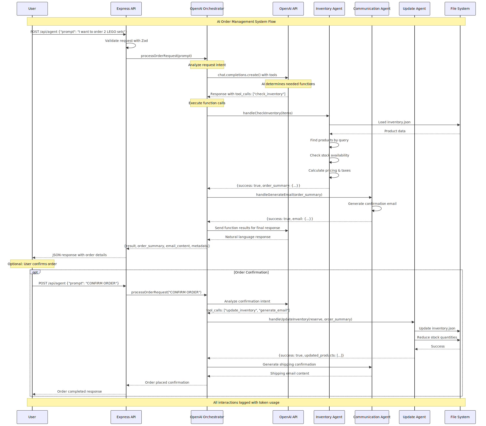

# AI Order Management System

A sophisticated multi-agent AI system for processing orders and managing inventory for small businesses. Built as a proof-of-concept for modernizing local toy stores and similar retail businesses.

## 🏪 Business Context

- Company: Toy Corner (Fictitious)
- Location: Alphen aan den Rijn, Netherlands
- Purpose: Demonstrate AI-powered customer service and order processing for small retail businesses

## 🤖 System Architecture

This system uses OpenAI's function calling capabilities to coordinate multiple specialized agents:

- OpenAI Orchestrator: Main AI coordinator that analyzes customer requests and delegates to appropriate agents
- Inventory Agent: Handles product lookups, stock checks, and pricing calculations
  Communication Agent: Generates professional customer emails and responses
- Update Agent: Manages inventory updates, reservations, and stock alerts

## 📋 Features

### Natural Language Processing

- Understands customer requests in natural language
- Intelligent product matching and quantity extraction
- Context-aware responses with professional tone

### Order Management

- Real-time inventory checking
- Automatic pricing calculations with tax and shipping
- Order confirmations and email generation
- Stock reservation capabilities

### Business Intelligence

- Low stock alerts and monitoring
- Store status and inventory reporting
- Token usage tracking for cost management

## 🛠 Technical Stack

- Backend: Node.js with Express and TypeScript
- AI: OpenAI GPT-3.5-turbo with function calling
- Validation: Zod for runtime type checking
- Data: JSON-based inventory management
- Documentation: Mermaid for UML diagrams

## 📊 System Flow



### The system follows this flow

- User submits natural language request
- OpenAI Orchestrator analyzes intent
- AI determines required functions and calls appropriate agents
- Business logic processes request (inventory, pricing, emails)
- AI synthesizes results into natural response
- Structured data returned with conversation-friendly message

## 🚀 Getting Started

### Prerequisites

- Node.js 18+
- OpenAI API key

### Installation

```bash

# Clone the repository
git clone [repository-url]
cd ai-order-management-system

# Install dependencies
npm install

# Set up environment variables
cp .env.example .env

# Edit .env with your OpenAI API key
# Build and start
npm run build
npm run dev
```

### Environment Configuration

```bash
NODE_ENV=development # Use 'production' for OpenAI API
PORT=3000
OPENAI_API_KEY=sk-your-key # Required for production mode
LOCAL_MODEL_URL=http://localhost:1234/v1 # For local development
```

# 📡 API Endpoints

### POST /api/agent

Main AI-powered endpoint for processing customer requests.

### Request

```json
{
  "prompt": "I want to order 2 LEGO Creator sets"
}
```

### Response

```json
{
"result": "Great news! Both LEGO Creator sets are available...",
"metadata": {
"agentsUsed": ["openai-orchestrator", "check_inventory"],
"executionTime": 1250,
"tokensUsed": 423
},
"order_summary": {
"items": [...],
"total": 89.95,
"status": "available"
},
"email_preview": "Dear Customer...",
"suggested_actions": ["Reply 'CONFIRM ORDER' to proceed"]
}
```

### GET /api/status

System and inventory status monitoring.

Response:

```json
{
"status": "operational",
"ai_mode": "enabled",
"store_info": {...},
"low_stock_alerts": [...],
"total_products": 6
}
```

### GET /api/agent

System information and usage examples.

## 🧪 Testing

### Example Requests

```bash

# Check product availability
curl -X POST http://localhost:3000/api/agent \
 -H "Content-Type: application/json" \
 -d '{"prompt": "Do you have any LEGO sets in stock?"}'

# Place an order
curl -X POST http://localhost:3000/api/agent \
 -H "Content-Type: application/json" \
 -d '{"prompt": "I want to order 3 Playmobil castles"}'

# Ask for store information
curl -X POST http://localhost:3000/api/agent \
 -H "Content-Type: application/json" \
 -d '{"prompt": "What are your store hours?"}'

# Check system status
curl http://localhost:3000/api/status
```

### Using REST Clients

The API works well with:

- Insomnia (recommended)
- Postman
- VS Code REST Client extension

## 🏗 Project Structure

```tree
src/
├── agents/
│ ├── openai-orchestrator.ts # Main AI coordinator
│ ├── inventory-agent.ts # Stock and pricing logic
│ ├── communication-agent.ts # Email generation
│ ├── update-agent.ts # Inventory updates
│ ├── openai-functions.ts # Function definitions for AI
│ └── function-handlers.ts # Function call implementations
├── data/
│ └── inventory.json # Product database
├── middleware/
│ └── validation.ts # Zod schema validation
├── routes/
│ └── agent.ts # API endpoints
├── types/
│ ├── index.ts # Basic types
│ └── order-types.ts # Business logic types
├── utils/
│ ├── config.ts # Environment configuration
│ └── openai-client.ts # AI client setup
└── app.ts # Express application
```

# 🔧 Development Features

### Environment Switching

- Development: Uses local model (LM Studio/Ollama) on localhost:1234
- Production: Uses OpenAI API

### Build Pipeline

- Automatic TypeScript compilation
- Data file copying to build directory
- Environment variable loading via npm scripts
- Concurrent development with hot reload

### Input Validation

- Zod schemas for request validation
- Runtime type checking
- Comprehensive error handling

## 📈 Business Applications

This system can be adapted for various small businesses:

- Toy Stores: Product inquiries and order processing
- Bookstores: Book recommendations and availability
- Hardware Stores: Tool and supply management
- Cafes/Restaurants: Menu inquiries and ordering
- Clothing Boutiques: Style advice and inventory

## 🤝 Contributing

This is a learning project demonstrating AI integration patterns. Key concepts covered:

- Multi-agent AI architecture
- OpenAI function calling
- TypeScript with Express
- Business logic separation
- Professional API design

## 📋 Requirements Fulfilled

- ✅ FR001-FR007: Express + TypeScript foundation
- ✅ FR008: OpenAI Agents SDK integration
- ✅ FR009: Orchestrator agent implementation
- ✅ FR010: Multiple specialized agents (3+)
- ✅ FR011: Tool functions with external capabilities
- ✅ FR012: Local/production model switching
- ✅ FR013: Fictitious company scenario
- ✅ FR014: UML sequence diagram
- ✅ FR015: Documentation integration
- ✅ FR016: Comprehensive documentation

## 📊 Performance Metrics

- Average Response Time: 1-3 seconds
- Token Usage: 300-800 tokens per request
- Success Rate: High accuracy in product matching
- Scalability: Handles multiple concurrent requests

## 🔮 Future Enhancements

- Database integration (PostgreSQL/MongoDB)
- Payment processing integration
- Multi-store support
- Advanced analytics dashboard
- Mobile app connectivity
- Real-time inventory synchronization

## 📄 License

This project is for educational purposes as part of a coding bootcamp assignment.

Built with TypeScript, Express, and OpenAI | Toy Corner Demo System
